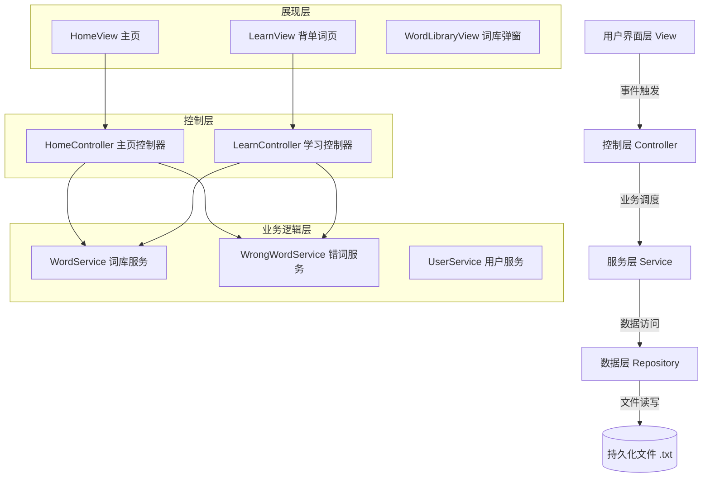

# 我会背单词 - 考研英语学习桌面工具

## 项目简介
基于 JavaFX 开发的考研英语背单词桌面应用，采用 MVP 分层架构，支持词库管理、错词复习、学习统计等核心功能。

## 技术栈
- **UI 框架**：JavaFX 22.0.2
- **构建工具**：Maven
- **JDK 版本**：OpenJDK 21
- **单元测试**：JUnit 5.9.2
- **CI/CD**：GitHub Actions

## 系统架构图


## 本地开发环境搭建
### 前置要求
- JDK 21+
- Maven 3.8+
- IntelliJ IDEA 2023+（推荐）

### 搭建步骤
1.  **克隆仓库**
    ```bash
    git clone https://github.com/moon3021/sprint0-Nexus.git
    cd sprint0-Nexus
    ```
2.  **导入 IDEA**
    - 打开 IDEA → `File` → `Open` → 选择项目根目录的 `pom.xml` → `Open as Project`
    - 等待 Maven 自动下载依赖（约 2-5 分钟）
3.  **配置运行环境**
    - 确保项目 SDK 为 JDK 21：`File` → `Project Structure` → `Project` → `SDK`
    - 确保词库文件 `红宝书.txt` 位于项目根目录
4.  **启动项目**
    - 找到 `MainUI.java` → 右键 → `Run 'MainUI.main()'`
    - 项目启动后，默认显示主页

## 核心业务模块职责说明
| 模块名称 | 包路径 | 核心职责 | 对外接口 |
|----------|--------|----------|----------|
| **HomeView** | `com.iwillrecitewords.view` | 主页 UI 渲染，包含签到、开始学习、错词复习、词库管理入口 | `getScene()` |
| **LearnView** | `com.iwillrecitewords.view` | 背单词页面 UI 渲染，展示单词、音标、释义、例句，提供「记错了」「认识」按钮 | `getScene()`, `updateWordUI(Word)` |
| **WordService** | `com.iwillrecitewords.service` | 词库加载、随机单词获取、词库总数统计 | `getRandomWord()`, `getWordLibrary()`, `getWordCount()` |
| **WrongWordService** | `com.iwillrecitewords.service` | 错词添加、去重、持久化、加载 | `addWrongWord(Word)`, `getWrongWordList()`, `getWrongWordCount()` |
| **FileUtil** | `com.iwillrecitewords.util` | 通用文件读写工具，封装 UTF-8 编码处理 | `readFile(String)`, `writeFile(String, String)`, `parseWordList(String)` |

## 如何运行测试
### 本地运行
1.  打开 IDEA
2.  右键 `src/test/java` 文件夹 → 选择 `Run 'All Tests'`
3.  或在终端运行：
    ```bash
    mvn clean test
    ```

### CI 流水线
- 每次 PR 或推送到 `develop`/`main` 分支时，GitHub Actions 会自动运行所有单元测试
- 测试失败会阻断 PR 合并，确保主干代码质量
- 测试报告自动上传到 Actions 归档

## Git Flow 分支规范
- **`main`**：稳定发布分支
- **`develop`**：迭代开发主干分支，始终保持 Green Build
- **`feature/*`**：功能开发分支，从 `develop` 创建，完成后 PR 合并回 `develop`
- **PR 要求**：至少 2 次完整评审闭环，CI 流水线全绿通过才能合并